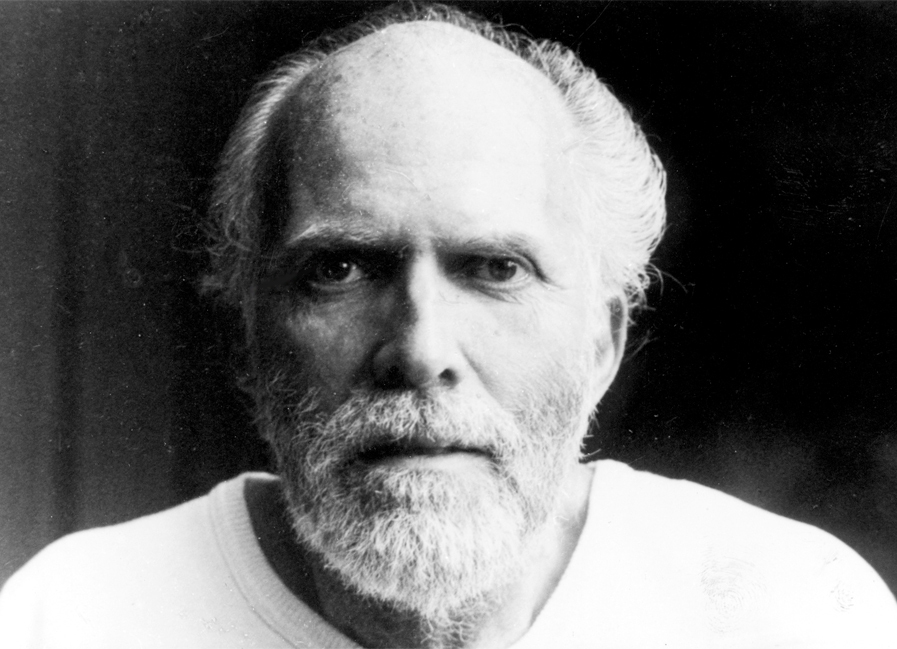

 

### Robert Adams

Robert Adams was an American Advaita teacher. In later life Adams held satsang with a small group of devotees in California, US. He mainly advocated the path of jñāna yoga with an emphasis on the practice of self-enquiry.

* Satsang recordings and PDFs available here: [robert-adams.info](https://robert-adams.info/)

 

### Francis Lucille

Francis is a spiritual teacher in the tradition of Advaita Vedanta (non-duality). A long time friend and disciple of Jean Klein whom he met in 1975, he was a friend of Robert Linssen, Wolter Keers, Yvan Amar, William Samuel and Robert Adams. He was also influenced by J. Krishnamurti, Krishna Menon and Wei Wu Wei whom he knew personally.

* Official website: [francislucille.com](https://francislucille.com/)
* Official YouTube channel: [www.youtube.com/channel/UCAYslZlNuBDD7FMvpjWLtoQ](https://www.youtube.com/channel/UCAYslZlNuBDD7FMvpjWLtoQ)
* Old blog Q&A: [ugjka.net/francis](https://ugjka.net/francis)

 

### Rupert Spira

Rupert Spira is an English teacher of the "direct path", a method of spiritual self-enquiry through talks and writing, and a notable English studio potter with work in public and private collections.

* Official website: [rupertspira.com](https://rupertspira.com/)
* Official YouTube channel: [www.youtube.com/user/rupertspira](https://www.youtube.com/user/rupertspira)

 